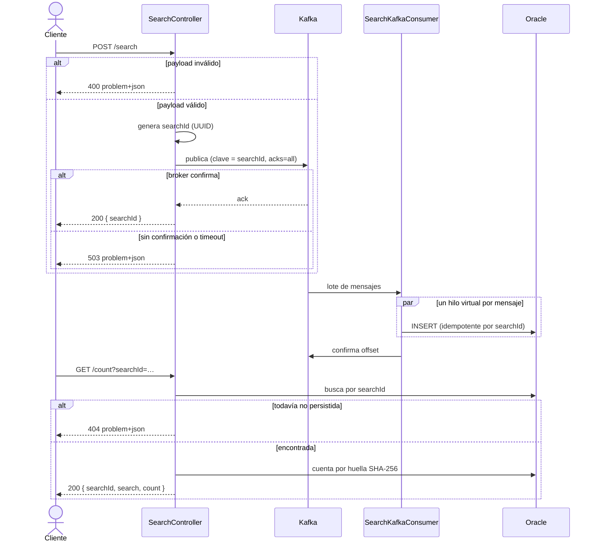
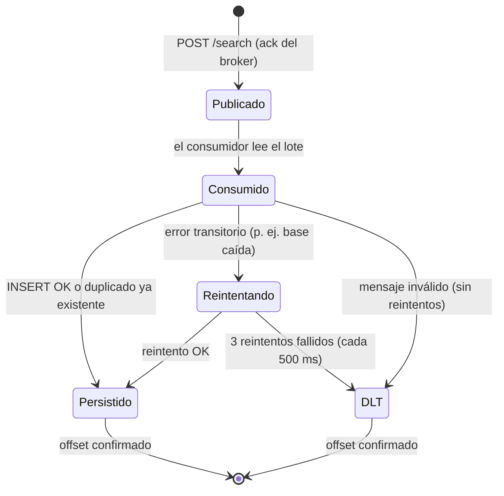

# Hotel Availability Search

Servicio que registra búsquedas de disponibilidad hotelera y permite consultar cuántas búsquedas iguales se realizaron.

**Stack:** Java 21 · Spring Boot 4.1 · Kafka 4.3 · Oracle 23 Free · Flyway · JUnit 5 · JaCoCo

```
POST /search ──► validación ──► Kafka: hotel_availability_searches ──► consumidor ──► Oracle
GET  /count  ──► búsqueda por searchId + cantidad de búsquedas iguales ◄──────────────────┘
```

## Ejecución

**Requisitos:** JDK 21, Maven 3.8+, Docker con Compose v2.

### Todo en Docker

```bash
mvn -B package -DskipTests      # la imagen copia el jar ya compilado
docker compose up -d --build
```

La aplicación queda en `http://localhost:8080`. Arranca cuando Kafka y Oracle están *healthy*, y Flyway crea el esquema al iniciar. La primera vez Oracle tarda unos minutos en crear la base.

```bash
docker compose ps               # estado de los contenedores
docker compose logs -f app      # logs de la aplicación
docker compose down             # apagar (los datos de Oracle persisten en un volumen)
docker compose down -v          # apagar y borrar los datos
```

Cada contenedor tiene límites de recursos: Oracle 3 GB, Kafka 1 GB y la aplicación 1 GB y 2 CPUs.

### Aplicación en el host

```bash
docker compose up -d kafka oracle
mvn spring-boot:run
```

Sin Oracle se puede usar el perfil `h2` (H2 en modo Oracle): `mvn spring-boot:run -Dspring-boot.run.profiles=h2`.

### Tests

```bash
mvn verify
```

No requieren Docker: usan Kafka embebido y H2. Incluyen tests unitarios, de controlador, de persistencia y de integración de punta a punta. El build falla si la cobertura de líneas baja del 80 %; el reporte queda en `target/site/jacoco/index.html`.

## API

La especificación OpenAPI 3.1 está en `openapi.yaml`; se puede abrir en [Swagger Editor](https://editor.swagger.io) o generar una página HTML con `npx @redocly/cli build-docs openapi.yaml -o api-docs.html`.

En `postman/Postman-Collection.json` hay una colección de Postman con el flujo completo, los casos de error y el preflight de CORS. Se ejecuta con el Collection Runner o con `npx newman run postman/Postman-Collection.json`.

### `POST /search`

```bash
curl -X POST localhost:8080/search -H 'Content-Type: application/json' -d '{
  "hotelId": "1234aBc",
  "checkIn": "29/12/2023",
  "checkOut": "31/12/2023",
  "ages": [30, 29, 1, 3]
}'
```
```json
{ "searchId": "3f0c8d2e-6c1b-4f7a-9a51-0d2b8e7c4a10" }
```

| Campo | Regla |
|---|---|
| `hotelId` | Obligatorio, hasta 64 caracteres |
| `checkIn`, `checkOut` | Obligatorios, formato `dd/MM/yyyy`, fecha real de calendario; `checkOut` posterior a `checkIn` |
| `ages` | De 1 a 20 enteros entre 0 y 120 |

### `GET /count?searchId={id}`

```json
{
  "searchId": "3f0c8d2e-6c1b-4f7a-9a51-0d2b8e7c4a10",
  "search": { "hotelId": "1234aBc", "checkIn": "29/12/2023", "checkOut": "31/12/2023", "ages": [30, 29, 1, 3] },
  "count": 2
}
```

`count` incluye la búsqueda consultada. Como la persistencia es asíncrona, una búsqueda recién creada puede devolver 404 durante unos milisegundos.

### Errores

Todas las respuestas de error siguen el formato RFC 9457 (`application/problem+json`):

| Código | Caso |
|---|---|
| 400 | Payload o parámetros inválidos, JSON mal formado |
| 404 | `searchId` inexistente |
| 503 | Kafka no confirmó la publicación |

```json
{
  "status": 400,
  "title": "Validación fallida",
  "detail": "El cuerpo de la solicitud no es válido",
  "errors": [
    { "field": "ages[1]", "message": "debe ser mayor o igual que 0" },
    { "field": "stayOrderValid", "message": "checkOut debe ser posterior a checkIn" }
  ]
}
```

## Flujo



## Decisiones de diseño

**Búsquedas iguales.** Dos búsquedas son iguales si coinciden el hotel (distinguiendo mayúsculas), las fechas y las edades, sin importar el orden de las edades: `[30, 29, 1, 3]` equivale a `[3, 29, 30, 1]`. Las repeticiones sí cuentan. Para cada búsqueda se calcula una huella SHA-256 sobre esa forma canónica, que se guarda en una columna indexada. Así el conteo de `/count` es una consulta por índice, sin comparar listas.

**Identificador único.** Cada invocación de `/search` recibe un UUID nuevo, aunque el payload se repita.

**Consistencia sin escritura doble.** `/search` escribe solamente en Kafka y el consumidor escribe solamente en la base. Ningún paso escribe en dos sistemas, por eso no hace falta el patrón *outbox*.
- **Productor:** publica con `acks=all` e idempotencia, y responde recién cuando el broker confirma (503 si no lo hace).
- **Consumidor:** confirma el offset solo después de persistir.
- **Reentregas:** el INSERT es idempotente (clave primaria `searchId`), así que una reentrega no duplica datos.

**Errores de consumo.** Ante un error transitorio, el consumidor hace 3 reintentos y después envía el mensaje al topic `hotel_availability_searches.DLT`. Un mensaje inválido va directo al DLT, sin frenar al resto.



**Concurrencia.** Tomcat y el consumidor usan hilos virtuales. El consumidor procesa cada lote en paralelo y un semáforo limita los inserts simultáneos. Los componentes no tienen estado mutable, y un test de integración lanza 200 requests simultáneos para verificar que no se repiten IDs ni se pierden búsquedas.

**Inmutabilidad.** Modelos, DTOs y mensajes son `record` con copia defensiva de las listas. Las fechas son `LocalDate` y se convierten una sola vez, al deserializar. La única clase mutable es la entidad JPA, porque JPA lo exige; no tiene setters y no sale del adaptador de persistencia.

**Seguridad.** No hay SQL escrito a mano: las consultas las genera Spring Data con parámetros enlazados. Un test verifica que un intento de inyección SQL se guarda como texto común.

## Arquitectura

Hexagonal: las dependencias apuntan siempre hacia el dominio (`infrastructure → application → domain`).

```
com.riu.hotel
├── domain                      Modelo y reglas de negocio, sin frameworks
├── application
│   ├── port.in / port.out      Casos de uso y puertos de salida
│   └── service                 Implementación de los casos de uso, sin anotaciones de Spring
└── infrastructure
    ├── adapter.in.rest         Controlador, DTOs y manejo de errores
    ├── adapter.in.messaging    Consumidor Kafka y su configuración de errores
    ├── adapter.out.messaging   Productor Kafka
    ├── adapter.out.persistence JPA y Spring Data
    ├── messaging               Contrato del mensaje Kafka
    └── config                  Cableado de casos de uso, topics y propiedades
```

## Configuración

| Variable | Valor por defecto |
|---|---|
| `DB_URL` | `jdbc:oracle:thin:@//localhost:1521/FREEPDB1` |
| `DB_USER` / `DB_PASSWORD` | `mindata` / `mindata` |
| `DB_POOL_SIZE` | `20` |
| `KAFKA_BOOTSTRAP_SERVERS` | `localhost:9092` |
| `CORS_ALLOWED_ORIGINS` | `http://localhost:8081` (orígenes separados por coma) |

El resto de la configuración (topic, particiones, timeout del productor y concurrencia del consumidor) está en `src/main/resources/application.yml`, bajo `app.kafka`.
